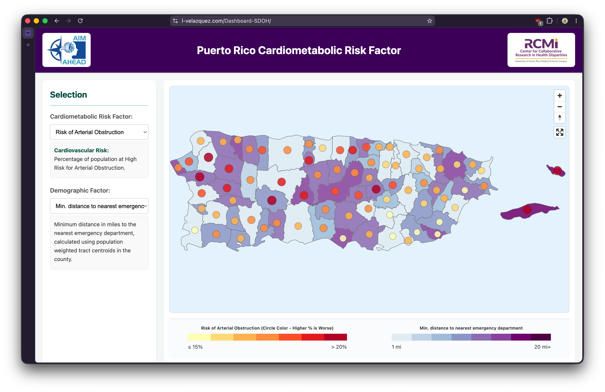

# Dashboard-SDOH


---


Live Page: [https://sdoh-rcmi.rcm.upr.edu](https://sdoh-rcmi.rcm.upr.edu)

Backup: [https://l-velazquez.github.io/Dashboard-SDOH/index.html](https://l-velazquez.github.io/Dashboard-SDOH/index.html)

Static web dashboard visualising cardiometabolic health risk and Social Determinants of Health (SDoH) across Puerto Rico municipalities and ZIP codes. Data sourced from Abartys Health Laboratory (cardiovascular, hepatic, renal, Vitamin D) and the US Census ACS (poverty, education, healthcare access).

---

## Pages

| File | Description |
|---|---|
| `index.html` | Municipality-level health risk map (main page) |
| `puerto_rico.html` | Landing / navigation page |
| `zipcodes.html` | ZIP code-level health indicator map |
| `analytics.html` | Municipality correlation analysis (Pearson, scatter plots) |
| `zip-analytics.html` | ZIP code correlation analysis |

## Tech Stack

- **MapLibre GL JS v3.6.2** — vector tile mapping
- **Chart.js** — scatter plots and correlation charts
- **Vanilla JavaScript** — no framework
- **Nginx 1.27-alpine** — production static file server (Docker)

## Data

Pre-computed JSON files in `/data/`:

- `cardiovascular_risk_by_municipality.json` — CHD, arterial obstruction, heart attack, Vitamin D, kidney, liver risk by municipality
- `cardio_risk_by_zipcodes.json` — same metrics at ZIP code granularity
- `sdoh_by_municipality.json` — ACS 2020 SDoH indicators (poverty, education, insurance, disability, healthcare access)
- `puerto_rico_cardiovascular_risk_by_zip_monthly_avg.json` — monthly time-series by ZIP

GeoJSON boundaries in `/maps/` (municipalities and ZIP Code Tabulation Areas).

---

## Running Locally

No build step required. Open any `.html` file directly in a browser, or serve with any static server:

```sh
npx serve .
# or
python3 -m http.server 8000
```

Then open `http://localhost:8000`.

---

## Docker Setup

The project ships with a Docker image based on `nginx:1.27-alpine`.

### Build

```sh
docker build -t sdoh-dashboard .
```

### Run

```sh
docker run -p 8080:80 sdoh-dashboard
```

Open `http://localhost:8080`.

The Nginx config includes:
- Gzip compression (level 6)
- Security headers (X-Frame-Options, X-Content-Type-Options, XSS-Protection)
- Tiered cache policy — HTML: no-cache; JS/CSS: 7 days; JSON/GeoJSON: 1 day; images: 30 days
- Health check endpoint at `/health`

---

## License

Copyright (c) 2025 University of Puerto Rico, Medical Sciences Campus. All Rights Reserved.

Authored and developed by Luis Fernando Javier Velázquez Sosa as part of his work with the institution. See [LICENSE](LICENSE) for details.
